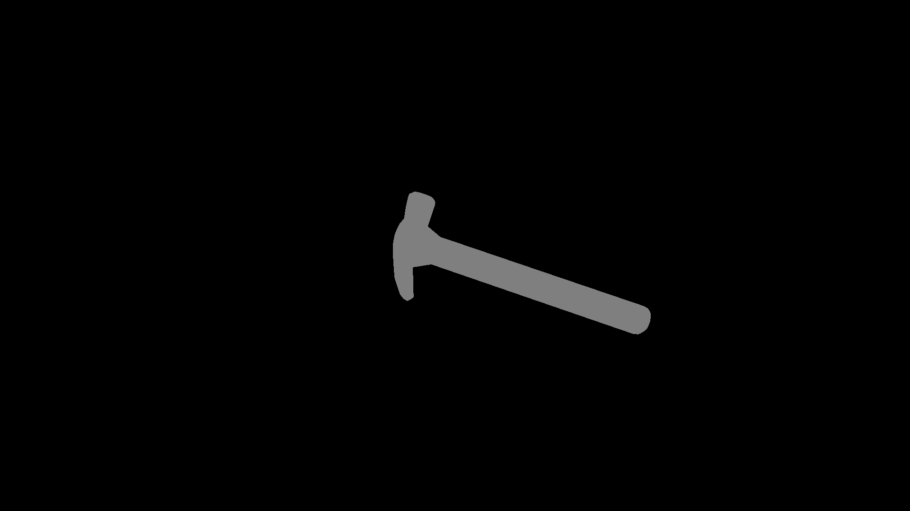
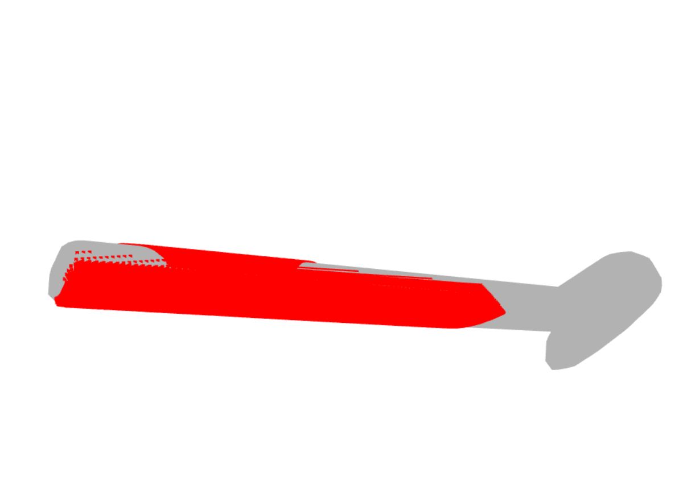

# Affordance_Labeling

The tool for labeling of the 3D models using the images of the object usage. 

## Environment configuration
Use `environment.yml` to install dependencies
```bash
conda env create -f environment.yml
conda activate labeling_env
``` 

## How it works

The input for the algorithm is the 3D model of an object and a folder containing the images of the object usage. The images should be of similar objects, but not necessary identical.

The inputs should be organised as follows:
```bash
    |-- data
        |-- model
            |-- object_model.obj
            |-- scenes
                |-- scene_image_0.jpg
                |-- scene_image_1.jpg
                |-- ...
``` 

The pipeline consists of four steps.
### Render generation
The model is used to generate renders from different view points and camera angles. The results are saved into the `renders` folder. The results include:
- `camera_params.json` for storing intrinsic and extrinsic camera parameters from Open3D
- `directions.npy` for stroing the direction and rotation of the camera
- `filelist.json` for storing the list of paths to the render files
- renders from different directions

 
 

### Scene processing
Scenes are the images of the object usage. For each scene we use several pretrained networks to find the area of the hand-object interaction. As a first step we use GroundingDINO with object name prompt to find the bounding box of the object in the scene. Then we use the MediaPipe for hand detection and build the hand bounding box. Finally the SAM model is applied to get the segmentation mask of the object, using the bounding box created by GroundingDINO. 

GroundingDINO example:


MediaPipe example:


SAM example:


The final result is the cropped part of the image that contains the segmentation mask of the object and holding hand:


If the models cannot locate the object, hand or segmentation mask the scene is skipped from further processing.

### Render matching
The results of the rendering and scene processing are used to find the best matchs between the scenes and renders. The idea is to find the camera direction that close to the direction that was used in the scene. For that purpose all renders are compared to the cropped scene image using IoU method. For the best match render the hand bounding box is transfered into. The result is the render with the hand mask.

### Point cloud labels
Each render is encoded as the direction vector from the center of the object and the rotation of the camera around this direction. Also, we can use intrinsic and extrinsic parameters of the virtual camera. These information can be used to obtain the depth image of the object from the same direction. The depth image corresponding tho the best match render and the mask at the render are used to generate a point cloud of the object part that is covered by the hand. This point cloud is considered to be in contact with the hand:


For each model the partial point cloud is derived from each scene where the models found all the required parts. The total point cloud is the union of partial point clounds:

    


## Acknowledgments
The scene image processing is based on [GroundingDINO](https://huggingface.co/docs/transformers/en/model_doc/grounding-dino), [MediaPipe](https://github.com/google-ai-edge/mediapipe) and [SAM](https://huggingface.co/docs/transformers/en/model_doc/sam). 